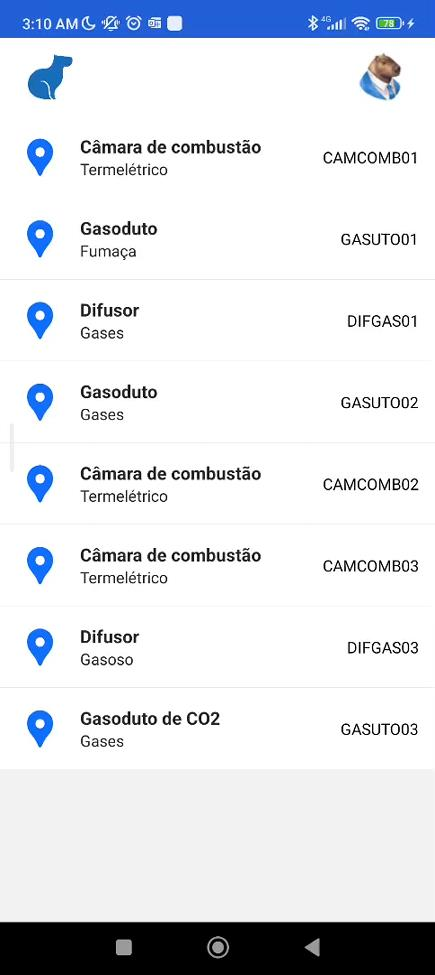
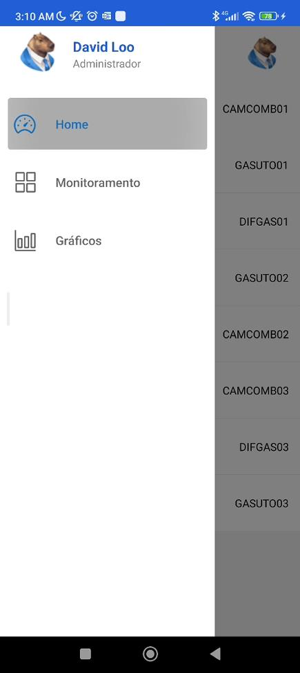
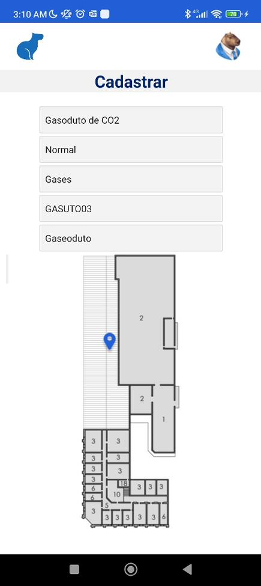
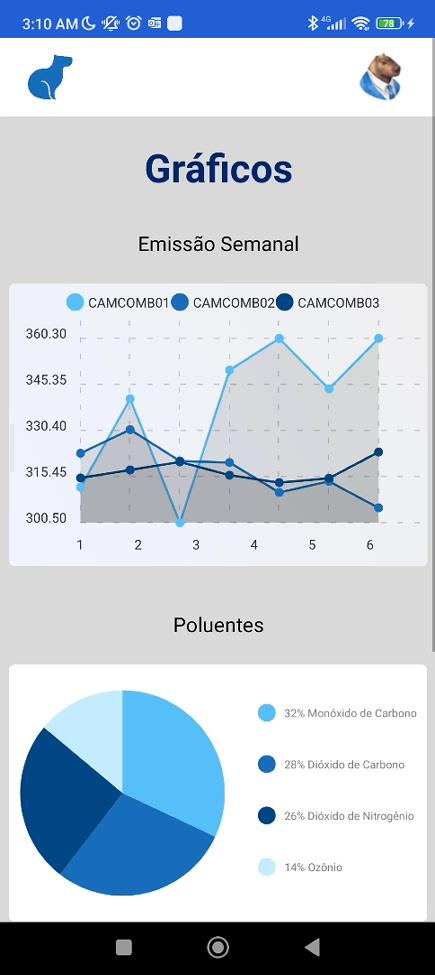

<p align="center">
  <a href="https://capivair.netlify.app/">
    
  </a>
</p>
<h1 align="center">
  Capivair
</h1>
<p>Este projeto consiste em um aplicativo para gerenciamento da emissão de poluentes, que visa solucionar problemas relacionados ao controle, conformidade e responsabilidade socioambiental. 
O objetivo é evitar multas ambientais, promover a reputação do cliente e facilitar a integração com formulários burocráticos de órgãos fiscalizadores. Além disso, o aplicativo permite alguma automação e a aplicação de inferências em dados para auxiliar na tomada de decisões. 
As principais áreas abrangidas são a visualização das taxas de poluentes por meio de dashboards, o cadastro de sensores em uma planta baixa da indústria para identificar os pontos de coleta das emissões, e o envio de notificações de alerta caso as taxas de emissão ultrapassem os limites permitidos.</p>

<br>


## Screenshots

<div style="display: flex;">
  <table style="border-collapse: collapse; border-style: none;">
    <tr style="border: none;">
       <td align="center" style="border: none;">
        <p><b>Home</b></p>
      </td>
       <td align="center" style="border: none;">
        <p><b>SideBar</b></p>
      </td>
       <td align="center" style="border: none;">
        <p><b>Monitoramento</b></p>
      </td>
       <td align="center" style="border: none;">
        <p><b>Chart</b></p>
      </td>
    </tr>
    <tr style="border: none;">
      <td align="center" style="border: none;">
        
      </td>
      <td align="center" style="border: none;">
        
      </td>
      <td align="center" style="border: none;">
        
      </td>
      <td align="center" style="border: none;">
        
      </td>
    </tr>
  </table>
</div>


## 🚀 Como executar
- Certifique-se de ter o Expo CLI instalado em sua maquina

  caso não tenha, instale:
  
  ```shell
  npm install -g expo-cli
  ```
  
- É necessário ter o Expo GO instalado no seu celular
<br>

1. **Executar o comando abaixo para instalar as dependências**

    ```shell
    npm install
    ```
1. **por fim, execute**:

   ```shell
   npm start
   ```
   ou 
   
   ```shell
   npx expo go
   ```
   <br>
   após escanear o QRCODE, divirta-se ❤️
   
<br>

## Tecnologias Utilizadas
- React Native
  - React NAtive Elements
  - React Native Chart-Kit
  - React Navigation
  - Hook
- JavaScript
- Expo Go
- VS Code
- Discord
- Notion

<br>
<h2 >Colaboradores</h2>
<table>
  <tr>
    <td align="center"><a href="https://github.com/AyrtonMaia0"><br /><sub><b>Ayrton Maia</b></sub></a></td>
    <td align="center"><a href="https://www.linkedin.com/in/erikavbsantos/"><br /><sub><b>Erika Santos</b></sub></a></td>
    <td align="center"><a href="https://github.com/Spatialcaver"><br /><sub><b>Everton Gabriel</b></sub></a></td>
    <td align="center"><a href="https://www.linkedin.com/in/brazadrian"><br /><sub><b>Gilmar Adrian</b></sub></a></td>
    <td align="center"><a href="https://www.linkedin.com/in/queziacssilva/"><br /><sub><b>Quézia Cassiano</b></sub></a></td>
    <td align="center"><a href="https://github.com/Karolayne-silva"><br /><sub><b>Karolayne Silva</b></sub></a></td>
    <td align="center"><a href="https://www.linkedin.com/in/l%C3%ADvia-vit%C3%B3ria-6a5771230/"><br /><sub><b>Livia Vitória</b></sub></a></td>
    <td align="center"><a href="https://www.linkedin.com/in/wildestmaii/"><br /><sub><b>Maiara Meneses</b></sub></a></td>
  </tr>
